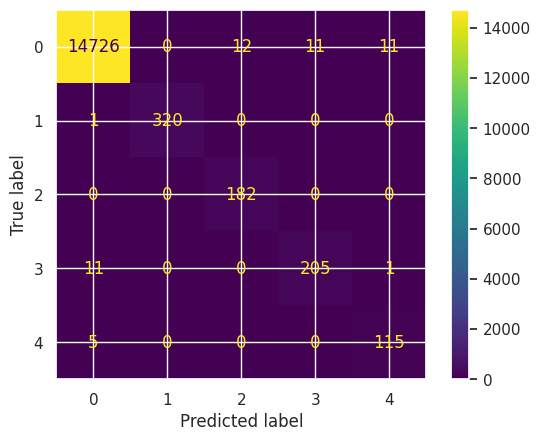

# Performance Comparison

Performance of the base model performance, the fine-tuned model performance,
and the ONNX model performance are observed and compared.

## Base Model Performance

The base model performance without training was pretty bad. The performance was
summarized below.

| Label                                                                  | Precision | Recall | F1    |
|------------------------------------------------------------------------|-----------|--------|-------|
| CashAndCashEquivalentsFairValueDisclosure                              |     0.103 |  0.517 | 0.171 |
| EmployeeServiceShareBasedCompensationTaxBenefitFromCompensationExpense |     0.035 |  0.412 | 0.064 |
| InterestExpense                                                        |     0.011 |  0.189 | 0.021 |
| RevenueFromContractWithCustomerIncludingAssessedTax                    |     0.002 |  0.050 | 0.003 |
| Overall                                                                |     0.026 |  0.343 | 0.049 |

This is in line with the expectation. The `BERT` models were not trained for
this problems. They were trained on masked language modeling (MLM) and next 
sentence prediction (NSP) problems. In fact, the top layers of the model for
token classification were randomized that the `transformers` library provide
a warning.

```
Some weights of DistilBertForTokenClassification were not initialized from the 
model checkpoint at distilbert-base-uncased and are newly initialized: 
['classifier.bias', 'classifier.weight'] You should probably TRAIN this model 
on a down-stream task to be able to use it for predictions and inference.
```

## Fine-tuned Performance

The model is a bit weak to getting the 
`RevenueFromContractWithCustomerIncludingAssessedTax` compared to the other 
selected labels. On the other hand, it has very strong performance on the
remaining labels, which improved the overall score.

Below is the summary of the performance on all the target labels.

| Label                                                                  | Precision | Recall | F1    |
|------------------------------------------------------------------------|-----------|--------|-------|
| CashAndCashEquivalentsFairValueDisclosure                              |     1.000 |  0.997 | 0.998 |
| EmployeeServiceShareBasedCompensationTaxBenefitFromCompensationExpense |     0.938 |  1.000 | 0.968 |
| InterestExpense                                                        |     0.949 |  0.945 | 0.947 |
| RevenueFromContractWithCustomerIncludingAssessedTax                    |     0.906 |  0.958 | 0.931 |
| Overall                                                                |     0.959 |  0.979 | 0.969 |

Below is the confusion matrix to further show the performance of the model. The
confusion matrix looks weird as it does not have all the labels. But this is
due to some of the labels not having a second token, this their `I-*` labels
did not have any members.



## ONNX Performance

The performance of the ONNX model the same as the Fine-tuned model as shown
below.

| Label                                                                  | Precision | Recall | F1    |
|------------------------------------------------------------------------|-----------|--------|-------|
| CashAndCashEquivalentsFairValueDisclosure                              |     1.000 |  0.997 | 0.998 |
| EmployeeServiceShareBasedCompensationTaxBenefitFromCompensationExpense |     0.938 |  1.000 | 0.968 |
| InterestExpense                                                        |     0.949 |  0.945 | 0.947 |
| RevenueFromContractWithCustomerIncludingAssessedTax                    |     0.906 |  0.958 | 0.931 |
| Overall                                                                |     0.959 |  0.979 | 0.969 |

On the notebook, the ONNX model predicted the same data for 31.9s, while the
Fine-tuned model on Pytorch runs at 16.4s. This performance holds true even on
100 iterations, which means it is not a warmup issue. An issue on github 
([ONNX BERT Issue]) was also talking about the same issue.

[ONNX BERT Issue]: https://github.com/microsoft/onnxruntime/issues/2803
